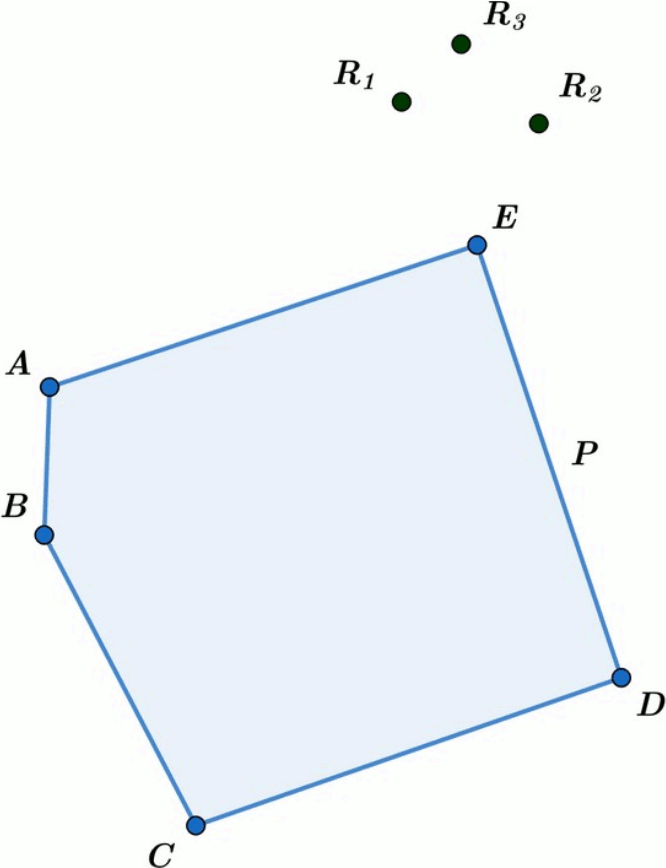

# Multi-UAV path planning BINPAT

Algorithm BINPAT for multi-UAV path planning to cover spatial areas, multi-region expansion and replanning.

Link to the [published paper](https://www.mdpi.com/1424-8220/22/6/2297/htm) describing the algorithm.



## Building

The project can either be built as standalone examples or as a static library for linking. Either way the source must be cloned:

```bash
git clone https://github.com/cvar-upm/multi_uav_planning_binpat.git
```

### Compiling the Example

Examples can be built with CMake version 3.15.0 or greater:

```bash
cd multi_uav_planning_binpat
mkdir build
cd build
cmake ..
cmake --build .
```

Example executables can be invoked once compilation is finished:

```bash
./generate_plan_example
```

### Building and Linking the Library

The library can be built and linked to an external project using CMake. The library target can be added by including the project root directory in the external project `CMakeLists.txt` and linked normally afterwards:

```
add_subdirectory(multi_uav_planning_binpat)

target_link_libraries(target planning_binpat)
```

C++ 17 or greater is required.

## Usage

The library exposes 3 functions: BINPAT planning, multi-region planning and replanning. Each of these functions has an example in the `examples` directory showing its usage:

| Name              | Algorithm                | Header                                                                                                 | Example               |
|-------------------|--------------------------|--------------------------------------------------------------------------------------------------------|-----------------------|
| `planning_binpat` | BINPAT Planning          | `auto planning_binpat(const region<Polygon> &region, Homeset &&homeset, const parameters &parameters)` | `planning_binpat.cpp` |
| `generate_plan`   | Expanded BINPAT Planning | `auto generate_plan(Regionset &&regionset, Homeset &&homeset, const parameters &parameters)`           | `generate_plan.cpp`   |
| `update_plan`     | Replanning               | `auto update_plan(Plan &&plan, const parameters &parameters, float threshold)`                         | `update_plan.cpp`     |

Additionally, each phase of the algorithm can be invoked independently:

| Name       | Phase      | Header                                                                                       |
|------------|------------|----------------------------------------------------------------------------------------------|
| `generate` | Generation | `auto generate(Regionset &&regionset, const Point &point)`                                   |
| `divide`   | Division   | `auto divide(Path &&path, std::size_t size, gmt::distance separation)`                       |
| `assign`   | Assignment | `auto assign(Pathset &&pathset, Swarm &&swarm, gmt::distance base, gmt::distance increment)` |
| `decorate` | Decoration | `auto decorate(Pathset &&pathset, Assignment &&assignment, gmt::distance inspection)`        |
| `link`     | Linking    | `auto link(Plan &&plan)`                                                                     |
| `select`   | Selection  | `bool select(Plan &&plan, idx::weight weight, float threshold)`                              |
